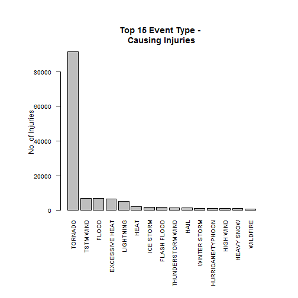
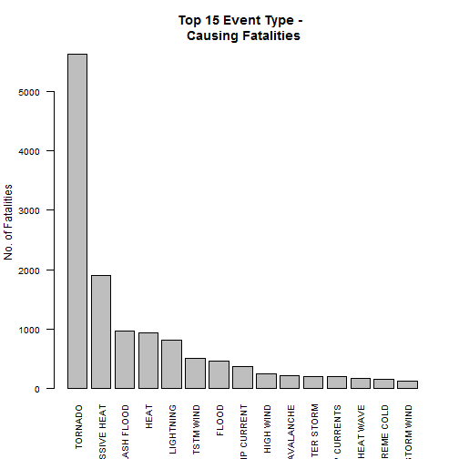
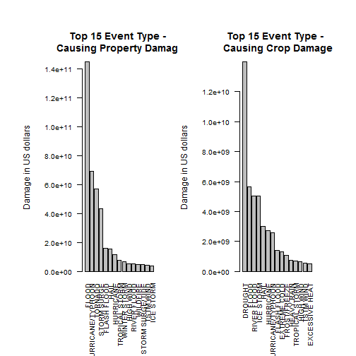

# Impact Study: Weather Related Events Across the U.S.

---
#Synopsis

Storms and other severe weather events can cause both public health and economic problems for communities and municipalities. Many severe events can result in fatalities, injuries, and property damage, and preventing such outcomes to the extent possible is a key concern.
The U.S. National Oceanic and Atmospheric Administration's (NOAA) storm database tracks characteristics of major storms and weather events in the United States, including when and where they occur, as well as estimates of any fatalities, injuries, and property damage. The data analysis in this report address the following questions:

Across the United States, which types of events (as indicated in the EVTYPE variable) are most harmful with respect to popuulation health?
Across the United States, which types of events have the greatest economic consequences?

#Data Processing

##Importing database

The data for this assignment come in the form of a comma-separated-value file compressed via the bzip2 algorithm to reduce its size. The read.table can read bz2 transparently.


```r
setwd("C:\\Coursera\\5_RepData")
raw_data <- read.table(file="repdata-data-StormData.csv.bz2", 
                       fill = T, sep = ",", header = T)
```

The BGN_DATE field needs to be converted from character to date type.


```r
raw_data$BGN_DATE <- strptime(as.character(raw_data$BGN_DATE), 
                              format = "%m/%d/%Y %H:%M:%S")
raw_data$END_DATE <- strptime(as.character(raw_data$END_DATE), 
                              format = "%m/%d/%Y %H:%M:%S")
```

The raw_data dataframe is converted to a data structure called data_table that is a package suitable for the analysis of large data.


```r
require(data.table)
```


```r
raw_data_table <- data.table(raw_data)
```

# Results

##Summarizing events impact on population health

Here the analysis is conserned with the impact of events on population health mainly (INJURIES and FATALITIES) can be summarized by aggregating the number of injuries and fatalities for each event type.


```r
# load('./raw_data_table.RData')
summarized_Injuries <- raw_data_table[, list(INJURIES = sum(INJURIES)), 
                                      by = EVTYPE]
summarized_Fatalities <- raw_data_table[, list(FATALITIES = sum(FATALITIES)), 
                                        by = EVTYPE]
```

Then this aggregated data is sorted descendingly.


```r
summarized_event_type_Injuries <- summarized_Injuries[order(INJURIES, decreasing = T),]
summarized_event_type_Fatalities <- summarized_Fatalities[order(FATALITIES, 
                                                                decreasing = T), ]

par(oma = c(5, 3, 2, 2))

barplot(height = summarized_event_type_Injuries[1:15, INJURIES], 
        names.arg = summarized_event_type_Injuries[1:15, 
    EVTYPE], las = 2, cex.axis = 0.8, cex.names = 0.8, 
    main = "Top 15 Event Type - \n Causing Injuries ", ylab = "No. of Injuries")
```

 


```r
barplot(height = summarized_event_type_Fatalities[1:15, FATALITIES], 
        names.arg = summarized_event_type_Fatalities[1:15, 
    EVTYPE], las = 2, cex.axis = 0.8, cex.names = 0.8, 
    main = "Top 15 Event Type - \n Causing Fatalities", ylab = "No. of Fatalities")
```

 

##Summarizing events impact on population health

###Economic consequences due to different events accross USA states.

Here the analysis is conserned with the impact of events on both (Property and Crop) damage. It can be summarized by aggregating the number of property damage and crop damage in US dollars for each event type.

####Pre-processing needed for calculating the property damage

First we need to ignore the property damage that have un-explained PROPDMGEXP fields like:

digits from (0-to-8)
letters like h or H.
symbols like ?.

Then we need to unify the units of the PROPDMG field that have the amount of dollars reported in different units:

b or B means billions
m or M means millions.
k or K means thousands.


```r
new_property_damage_table0 <- raw_data_table[tolower(PROPDMGEXP) == "", 
                                             list(EVTYPE = EVTYPE, 
                                                  DAMAGE = PROPDMG), ]

new_property_damage_table1 <- raw_data_table[tolower(PROPDMGEXP) == "b", 
                                             list(EVTYPE = EVTYPE, 
                                                  DAMAGE = PROPDMG * (10^9)), ]

new_property_damage_table2 <- raw_data_table[tolower(PROPDMGEXP) == "m", 
                                             list(EVTYPE = EVTYPE, 
                                                  DAMAGE = PROPDMG * (10^6)), ]

new_property_damage_table3 <- raw_data_table[tolower(PROPDMGEXP) == "k", 
                                             list(EVTYPE = EVTYPE, 
                                                  DAMAGE = PROPDMG * (10^3)), ]

new_property_damage_table <- rbind(new_property_damage_table0, 
                                   new_property_damage_table1, 
                                   new_property_damage_table2, 
                                   new_property_damage_table3)

property_damage_table <- new_property_damage_table[, list(Damage = sum(DAMAGE)), 
                                                   by = EVTYPE]
```

#####Top 15 events causing property damage:


```r
property_damage_table[1:15, ]
```

```
##                    EVTYPE    Damage
##  1:             TSTM WIND 4.485e+09
##  2:                  HAIL 1.573e+10
##  3:         FREEZING RAIN 8.112e+06
##  4:                  SNOW 1.476e+07
##  5: ICE STORM/FLASH FLOOD 0.000e+00
##  6:              SNOW/ICE 3.000e+04
##  7:    THUNDERSTORM WINDS 1.736e+09
##  8:           RECORD COLD 5.600e+07
##  9:     THUNDERSTORM WIND 3.483e+09
## 10:           RIP CURRENT 1.000e+03
## 11:               TORNADO 5.694e+10
## 12:           FLASH FLOOD 1.614e+10
## 13:            HIGH WINDS 6.083e+08
## 14:          FUNNEL CLOUD 1.946e+05
## 15:                  HEAT 1.797e+06
```

#####Pre-processing needed for calculating the crop damage

Similarly we need to ignore the property damage that have un-explained PROPDMGEXP fields like:

digits from (0-to-8)
letters like h or H.
symbols like ?.

Then we need to unify the units of the PROPDMG field that have the amount of dollars reported in different units:

b or B means billions
m or M means millions.
k or K means thousands.


```r
new_crop_damage_table0 <- raw_data_table[tolower(CROPDMGEXP) == "", 
                                         list(EVTYPE = EVTYPE, 
                                              DAMAGE = CROPDMG), ]

new_crop_damage_table1 <- raw_data_table[tolower(CROPDMGEXP) == "b", 
                                         list(EVTYPE = EVTYPE, 
                                              DAMAGE = CROPDMG * (10^9)), ]

new_crop_damage_table2 <- raw_data_table[tolower(CROPDMGEXP) == "m", 
                                         list(EVTYPE = EVTYPE, 
                                              DAMAGE = CROPDMG * (10^6)), ]

new_crop_damage_table3 <- raw_data_table[tolower(CROPDMGEXP) == "k", 
                                         list(EVTYPE = EVTYPE, 
                                              DAMAGE = CROPDMG * (10^3)), ]

new_crop_damage_table <- rbind(new_crop_damage_table0, new_crop_damage_table1, 
                               new_crop_damage_table2, new_crop_damage_table3)

crop_damage_table <- new_crop_damage_table[, list(Damage = sum(DAMAGE)), by = EVTYPE]
```

#####Top 15 events causing crop damage:


```r
crop_damage_table[1:15, ]
```

```
##                    EVTYPE    Damage
##  1:               TORNADO 4.150e+08
##  2:             TSTM WIND 5.540e+08
##  3:                  HAIL 3.026e+09
##  4:         FREEZING RAIN 0.000e+00
##  5:                  SNOW 1.000e+04
##  6: ICE STORM/FLASH FLOOD 0.000e+00
##  7:              SNOW/ICE 0.000e+00
##  8:          WINTER STORM 2.694e+07
##  9:    THUNDERSTORM WINDS 1.907e+08
## 10:           RECORD COLD 0.000e+00
## 11:            HEAVY RAIN 7.334e+08
## 12:             LIGHTNING 1.209e+07
## 13:     THUNDERSTORM WIND 4.148e+08
## 14:             DENSE FOG 0.000e+00
## 15:           RIP CURRENT 0.000e+00
```

###Plotting the top 15 event type that causes property and crop damage:

NOTE: it is a single figure (a single panel with two charts).


```r
par(mfrow = c(1, 2))
par(mar = c(3, 6, 4, 2) + 0.1, mgp = c(5, 1, 0))

par(oma = c(5, 2, 2, 2))
Property_damage_pareto <- property_damage_table[order(Damage, decreasing = T),]
barplot(height = Property_damage_pareto[1:15, Damage], 
        names.arg = Property_damage_pareto[1:15, EVTYPE], 
        las = 2, cex.axis = 0.8, cex.names = 0.8, 
        main = "Top 15 Event Type - \n Causing Property Damage", 
        ylab = "Damage in US dollars")


Crop_damage_pareto <- crop_damage_table[order(Damage, decreasing = T), ]
barplot(height = Crop_damage_pareto[1:15, Damage], 
        names.arg = Crop_damage_pareto[1:15, EVTYPE], 
        las = 2, cex.axis = 0.8, cex.names = 0.8, 
        main = "Top 15 Event Type - \n Causing Crop Damage", 
        ylab = "Damage in US dollars")
```

 

